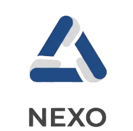

# Nexo – Backend

<!-- LOGO -->

<p align="center">
  
</p>

Backend de **Nexo**, una red social en desarrollo enfocada en una arquitectura clara, lógica de negocio sólida y escalabilidad.

---

## 🧱 Stack Tecnológico

* Node.js
* Express
* TypeScript
* MongoDB
* Mongoose

---

## ⚙️ Funcionalidades actuales

* Registro y gestión de usuarios
* Creación de publicaciones
* Sistema de likes (like / unlike)
* Contador de likes sincronizado
* Validaciones y manejo de errores

---

## 🚀 Instalación

```bash
pnpm install
pnpm dev
```

---

## 🔐 Variables de entorno

```env
PORT=
MONGO_URI=
JWT_SECRET=
```

---

## 📁 Estructura general

```
src/
 ├── controllers/
 ├── services/
 ├── models/
 ├── routes/
 ├── middlewares/
 ├── exceptions/
 ├── config/
 ├── validators/
 ├── interfaces/
 └── helpers/
```

---

## 📌 Estado del proyecto

En desarrollo activo.

Actualmente enfocado en el backend y la implementación de la lógica principal antes de avanzar al frontend.

---

## 📝 Notas

Este proyecto forma parte de un desarrollo personal con fines de aprendizaje y consolidación de habilidades fullstack.
